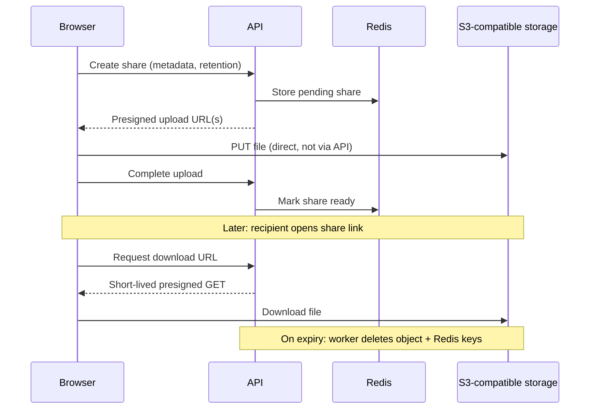

# Toss

A small file-sharing app: upload a file, pick how long it should stay online, and share a link. No sign-up, no accounts, no file bytes through the API.

Built as a TypeScript monorepo to practice real-world patterns—presigned object storage, Redis-backed lifecycle, multipart uploads, and a split web/API deployment.

## What it does

Someone lands on the home page, drops a file (up to 500 MB), and chooses **24 hours** or **7 days** retention. The app uploads the file, then sends them to a download page—the same page recipients see when they open the share link.

Recipients get a simple page with the file name, size, and time left. They click **Download** to fetch the file; nothing auto-downloads on page load. When retention ends, the file and its metadata are removed automatically.

One upload = one share link. Upload again if you want another link.

## How it works (high level)



The API never proxies file bodies. It only issues presigned URLs, stores share metadata in Redis, and runs background cleanup when shares expire.

## Technical highlights

These are the parts worth calling out if you are evaluating the codebase:

| Area | Approach |
|------|----------|
| **Upload path** | Browser uploads directly to object storage via presigned URLs; the API stays out of the data plane |
| **Large files** | Multipart S3 uploads for files > 8 MB (8 MB parts, 4 concurrent); smaller files use a single PUT |
| **Lifecycle** | Redis holds share metadata and an expiry index; a keyspace listener plus a sweeper fallback delete bucket objects when retention ends |
| **Abandoned uploads** | Pending shares expire after one hour so half-finished uploads do not linger in storage |
| **Downloads** | Presigned GET URLs are minted only when the user clicks Download (short TTL), not when the page loads |
| **Safety** | Executable and installer-like extensions are blocked at share creation |
| **Deployment** | Separate web and API services (e.g. on Railway), CORS between origins, bucket CORS for browser PUTs |

Shared constants and types (retention, size limits, multipart thresholds) live in `packages/shared` so the web app and API stay aligned.

## Stack

- **Monorepo** — Turborepo, Bun workspaces
- **Web** — React, Vite, React Router, Tailwind, shared UI package
- **API** — Hono on Bun
- **Data** — Redis (metadata + expiry), S3-compatible object storage (Railway bucket or MinIO locally)
- **Language** — TypeScript throughout

## Repository layout

```
apps/
  api/     Hono API: shares, presigning, expiry workers
  web/     React SPA: upload UI, download page (/d/:id)
  raycast/ Raycast extension: upload Finder selection, copy share link
packages/
  shared/  Shared types and limits
  ui/      Reusable UI components (shadcn-style)
```

Domain language and product decisions (what a “share” is, retention rules, etc.) are documented in [CONTEXT.md](./CONTEXT.md).

## Try it locally

Requires Docker (Redis + MinIO), Bun, and env files from the examples.

```bash
docker compose up -d
cp apps/api/.env.example apps/api/.env
bun install
bun run dev
```

Open http://localhost:5173 — the Vite dev server proxies API routes to the backend on port 3001.
